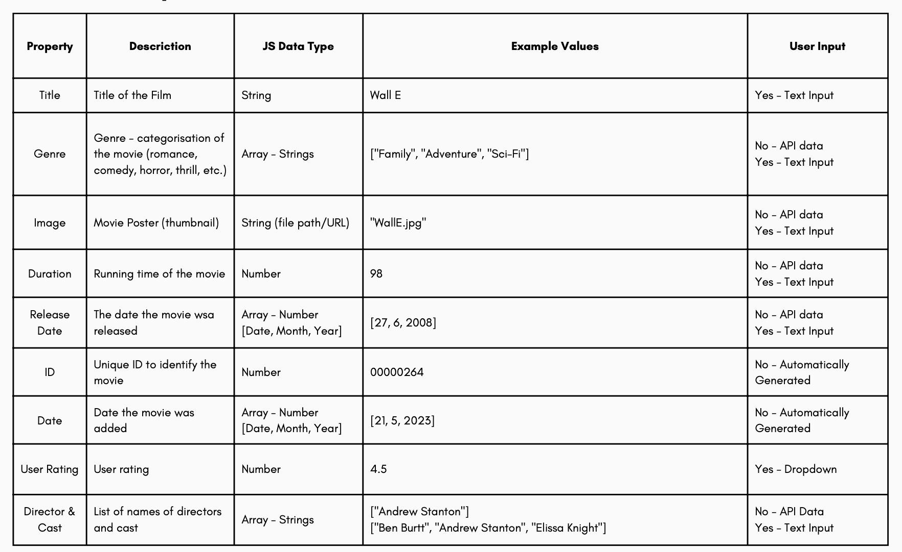
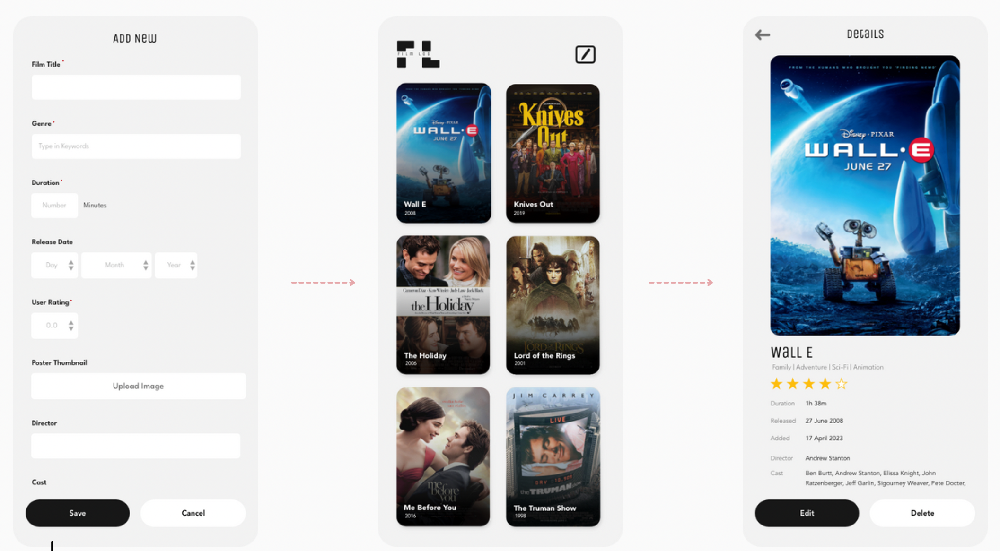
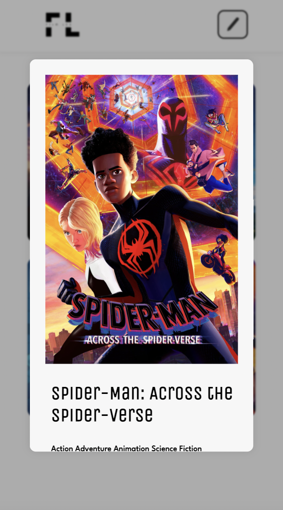
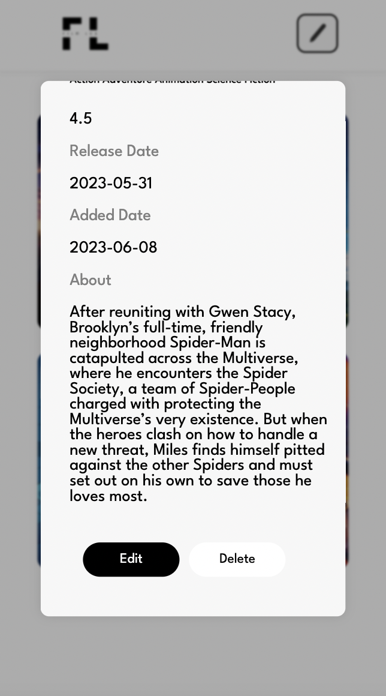
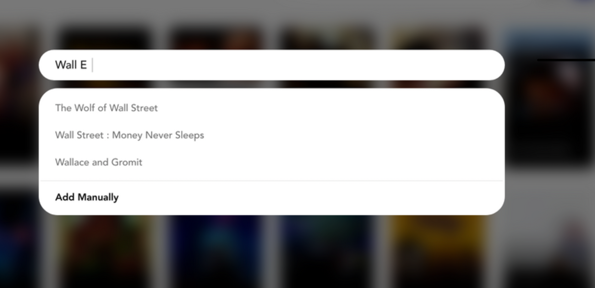
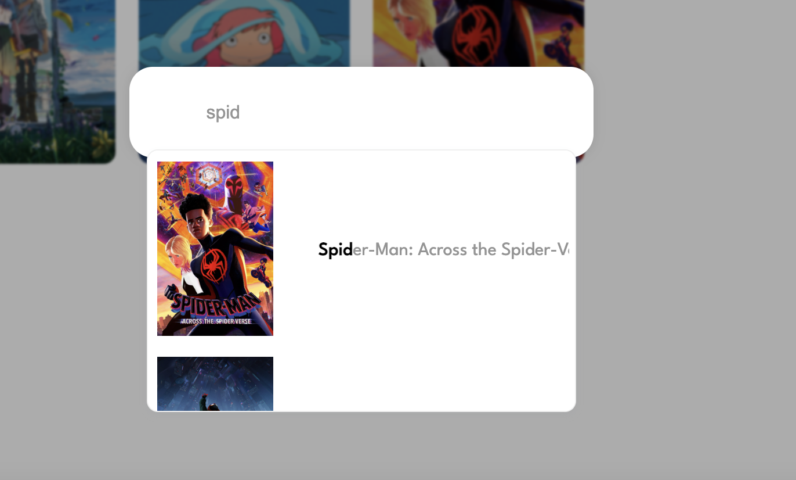

# Film Log - Project Overview

Film Log is a web application that allows users to track their media consumption, specifically movies - hence the name Film Log. Users can keep track of the different movies
they have watched, along with detailed information of each movie such as the genres, synopsis, poster image, and release date.

### Features

There are 4 main functions of the application which are the following:

**Adding new movies**

Users can save movies and its information by either manually inputting everything (from the 'title' to the 'synopsis'), or search up a movie which will fetch all the data from an API source, and save automatically.

**Viewing saved movies**

Users can review their saved items and edit (editting is not coded as it is not part of the assignment criteria, but can be in the future)

**Deleting movies**

Users can delete movies from their saved list

**Rating movies**

Users can give a personal rating out of 5 when saving a new movie


## Source References

#### MOVIE API

Movie data (for when users search up and save - not manually) was fetched from an API source by @tarekraafat.

```
https://cdn.jsdelivr.net/npm/@tarekraafat/autocomplete.js@10.2.7/dist/autoComplete.min.js

{
    "adult": false,
    "backdrop_path": "/1IM8i8HiomFC4y6NRyBuDrHJWg3.jpg",
    "genre_ids": [12, 10751, 14, 10749],
    "id": 447277,
    "original_language": "en",
    "original_title": "The Little Mermaid",
    "overview": "The youngest of King Triton’s daughters, and the most defiant, Ariel longs to find out more about the world beyond the sea, and while visiting the surface, falls for the dashing Prince Eric. With mermaids forbidden to interact with humans, Ariel makes a deal with the evil sea witch, Ursula, which gives her a chance to experience life on land, but ultimately places her life – and her father’s crown – in jeopardy.",
    "popularity": 1482.026,
    "poster_path": "/ym1dxyOk4jFcSl4Q2zmRrA5BEEN.jpg",
    "release_date": "2023-05-18",
    "title": "The Little Mermaid",
    "video": false,
    "vote_average": 6.098,
    "vote_count": 512
}
```

Above is an example of a JSON for The Little Mermaid.

Only the necessary key:value s were extracted from each movie object and saved into the local storage.


#### JS VANILLA

A Javascript vanilla library was used to achieve the auto complete element for when users search for movies.

```
https://cdn.jsdelivr.net/npm/@tarekraafat/autocomplete.js@10.2.7/dist/autoComplete.min.js

```

And the css file was downloaded and edited to fit the design style of the web application.


## User Guide

When the website is initially run, there will not be any "movie tiles" as there's no movie data saved in the local storage.

**To add a movie:**

1. Click on the add button (pencil image in the top right corner)

This will open a search bar

2. Start typing the title of the movie you want to add and click on the movie you are after

If the movie you're after does not come up, there is an option to "Add Manually" which should pop up beneath the search bar as a button.

3. Once you've selected a movie, or chose to add manually, a pop up window should open with input fields.

4. Put in all necessary information and 'Save'.

5. If the data has successfully been saved into the local storage, a portrait tile with a movie poster image, title and your rating should be displayed on the main page.


**To view a saved movie:**

Tap a movie tile (on the main page, that you saved) you want to view, and a pop up window with all of its information should be displayed. You can also delete the saved item with the 'delete' button on this window.


## Installation

### Code Repository (Git)

To enable version control, a Git repository was set up. This section describes how to clone the repository and explains the structure of the repository.

1. Clone the repository:
- Ensure you have git installed on your local machine.
- In the terminal window, switch to the local directory where you want the cloned repository saved.
- Run the following command to clone the repository:
```
git clone https://github.com/seroPark/spar3325-tracker.git
```


### Code Structure

**index.html**
includes the basic set up of the elements on the website (Logo, Buttons, Popup windows, etc.)

**style.css**
includes the styling of the html elements (font, element size, color, etc.)

**script.js**
handles basic functions of the website
- Initiating Overlay
- Opens and Closes the Search Bar & AutoComplete on click
- Closes movie info window when user clicks outside the window
- Pop up windows & overlay display
- Setting max date for release date (manual add) as today
- Saving Movie Manually

Functions that were too big and complicated were taken out into separate .js files.


**autoComplete().js** handles the auto-complete search bar. When the user selects a movie from the auto-complete result list, this function also fetches the API data and saves into the local storage along with user input data (rating and comments).

**renderSaved().js** handles displaying movie tiles on the main screen. 

More details written as comments in the file.

## Development Process (Log)

the development process, iterations, and improvements, with a strong emphasis on lessons learned and best practices.

**1. Setting Up Code Repository**

GitHub was used to set up a code repository as it allows easy version controls

**2. Data Model**

After setting up the code repository and syncing it with visual studio code, I started coding with the goal of achieving my design that I created for assignment 2.

However, the api that I found did not have some of the data that I intended on using.

I planned on fetching all the data shown below in my A2 data model



I had to make changes to the types of information shown to the users.

In the end, the list of move information/data that gets saved and shown to the users came to be:
- Title
- Genres
- Poster Thumbnail (Image)
- Release Date 
- User Rating

Date Added and ID were created using js, where date added fetches the date today and ID is the index of the movie in the favMovies() array.

**3. Set up basic HTML** such as header, logo, buttons, pop up windows, etc.

**4. Search Bar - Auto Complete Function**
The search bar with auto complete function, as referenced, was sourced from a js vanilla library:

```
https://cdn.jsdelivr.net/npm/@tarekraafat/autocomplete.js@10.2.7/dist/autoComplete.min.js

```

**5. Saving into Local Storage**

Data fetched from the selection from the auto complete result list, or manually added data was saved into the local storage in the format of JSON.

**6. Render Saved Items**

Local storage data is displayed as movie tiles on the main screen with the function renderSaved().

**7. Adding error prevention elements**

For Add Movie windows and Movie info window, confirmation pop ups were added to make sure the data doesn't get discarded or deleted (or saved without proper user input) due to the user accidentally clicking on a save/cancel/delete button.


## Iterations & Changes

Original Mobile version had separate "pages" for when adding movies and viewing saved movies.



However, this was changed into popup windows similar to the web version with the difference in size. This was because I wanted to make it feel like everything was happening on one single screen/page rather than moving from page to page. 





A2 design only had movie titles as the auto complete result. 



However, after testing, it was revealed that there are so many movies with the same title. Hence, the poster is displayed additional to the title in the search result (auto completed list).




